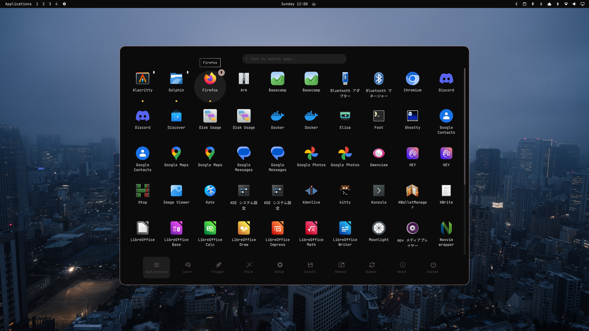
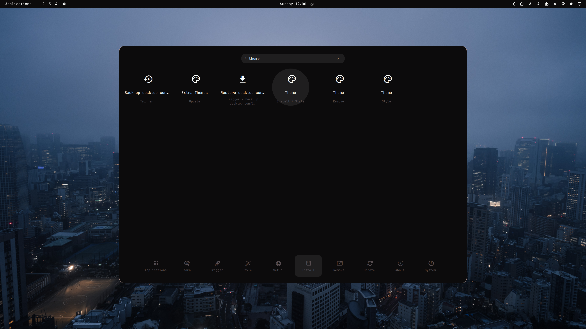
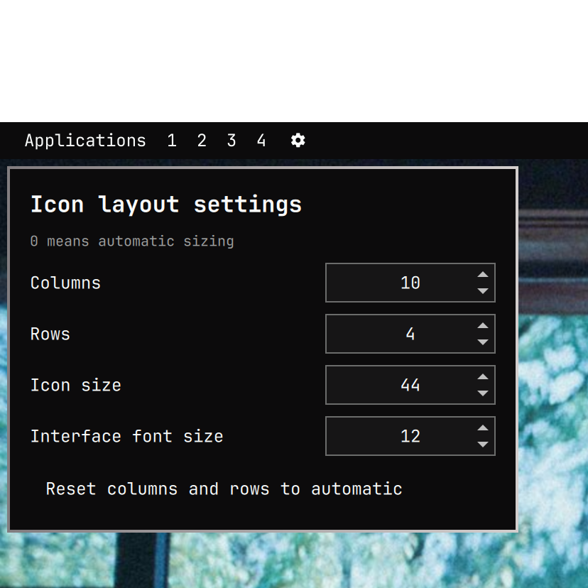

# Application Launcher

Application Launcher is an Omarchy launcher plugin with a single-level application grid, native Omarchy menu actions, keyboard search, and configurable layout controls. It reuses Omarchy's application library, menu data, theme colors, icon font, and launch behavior.



_Main launcher view with applications, pinned items, running indicators, and the native bottom menu._



_Search results combine applications and Omarchy menu actions, with the matching category shown below each result._

## Features

- Single-level grid using Omarchy's native application library.
- Native menu actions and categories in the same launcher.
- Search across applications and menu actions.
- First result selected automatically after a query is entered.
- Arrow-key, `Tab`, and `Shift+Tab` navigation.
- `Enter` launches the selected application or menu action.
- The bottom category navigation follows the selected search result.
- Unrelated menu entries are omitted from search results.
- Application labels support up to two naturally wrapped lines; hover shows the full name.
- Pinned applications keep a visible pin indicator.
- Running applications use a fixed yellow status dot.
- Native theme colors and Omarchy's configured menu icon font.
- Right-click settings from the top-bar launcher widget.
- Configurable columns, rows, icon size, and interface font size.
- Adaptive card, cell, and row spacing.
- Persistent layout state.

## Installation

```sh
omarchy plugin add https://github.com/iamcheyan/omarchy-launcher.git --enable
```

The plugin provides `menu` and `bar-widget` entry points. Enable the **Application Launcher** widget in the top bar if it is not added automatically.

## Opening

Click the top-bar **Applications** widget or summon it directly:

```sh
omarchy-shell shell summon iamcheyan.launcher '{"menu":"root"}'
```

The bottom navigation switches between Applications, Learn, Trigger, Style, Setup, Install, Remove, Update, About, and System. These entries come from Omarchy's native menu data.

## Layout settings

Right-click the **Applications** widget to open the native settings panel:



_Right-click the top-bar launcher to configure columns, rows, icon size, and interface font size._

- **Columns** — number of application columns.
- **Rows** — number of visible rows.
- **Icon size** — application icon size.
- **Interface font size** — shared launcher text size.
- **Reset columns and rows to automatic** — restore automatic grid dimensions.

Card width is calculated from columns, icon size, and text size. Cells also account for label space and a vertical gap between rows, so larger icons or text expand the layout instead of being forced into a fixed card.

Settings are stored at:

```text
~/.local/state/iamcheyan-launcher/layout.json
```

## Search and keyboard navigation

Search covers installed applications and Omarchy menu actions. The first match is selected automatically, the selected result is highlighted, and the bottom category follows it.

| Key | Action |
| --- | --- |
| `Left` / `Right` | Previous or next result |
| `Up` / `Down` | Result in the previous or next grid row |
| `Tab` | Next result |
| `Shift+Tab` | Previous result |
| `Enter` | Launch or execute the selected result |
| `Escape` | Clear the query, then close the launcher |

Labels show at most two lines and use natural word wrapping. Hovering an item displays its complete name.

## Pins and running state

Use the pin control on an application item to pin or unpin it. A pinned item keeps a small pin visible in its upper-right corner. The circular action background appears only while the pointer is over the control.

A running application shows a small yellow dot below its label. The dot uses a fixed yellow color and does not change with the active theme.

## Native integration

- Applications are discovered and launched through Omarchy's application library.
- Menu categories, labels, icons, descriptions, and actions come from Omarchy's `omarchy-menu.jsonc` files.
- Menu colors come from the active Omarchy theme.
- Menu glyphs use Omarchy's configured menu icon font.
- The top-bar widget follows the native plugin settings contract.

The plugin does not create a second application index or menu-action format.

## Files

- `Menu.qml` — launcher surface, grid, search, categories, pins, and keyboard navigation.
- `BarWidget.qml` — top-bar widget and right-click settings entry.
- `SettingsPanel.qml` — native layout and typography settings.
- `MenuModel.js` — menu parsing, merging, flattening, and category helpers.
- `RunningApps.qml` — running-application integration.

## Validation

```sh
omarchy plugin validate .
qmllint -I "${OMARCHY_PATH:-/usr/share/omarchy}/shell" \
  Menu.qml BarWidget.qml SettingsPanel.qml RunningApps.qml
```

## Removal

```sh
omarchy plugin remove iamcheyan.launcher
rm -f ~/.local/state/iamcheyan-launcher/layout.json
```

The second command is optional and resets the saved layout for a future installation.

## License

MIT. See [LICENSE](LICENSE).

---

# 中文说明

Application Launcher 是一个 Omarchy 启动器插件，提供单层应用网格、原生菜单操作、键盘搜索和可配置布局。插件复用 Omarchy 的应用库、菜单数据、主题颜色、图标字体和启动逻辑。


_主启动器界面，包含应用、固定项目、运行状态指示器和底部菜单。_


_搜索应用和 Omarchy 菜单操作，并显示每个结果所属的分类。_

## 功能特性

- 使用 Omarchy 原生应用库的单层应用网格。
- 在同一个启动器中显示原生菜单操作和分类。
- 同时搜索应用和菜单操作。
- 输入关键词后自动选中第一个结果。
- 使用方向键、`Tab` 和 `Shift+Tab` 导航。
- 按 `Enter` 启动应用或执行菜单操作。
- 底部分类导航跟随当前选中的结果。
- 搜索结果过滤掉无关的菜单条目。
- 应用名称最多显示两行，并自然换行；鼠标悬停显示完整名称。
- 固定应用持续显示图钉。
- 运行中的应用显示固定黄色小圆点。
- 使用原生主题颜色和 Omarchy 菜单图标字体。
- 从顶栏右键打开设置。
- 可调整横向数量、纵向数量、图标尺寸和界面字号。
- 卡片、网格单元和行间距自适应变化。
- 布局状态持久保存。

## 安装

```sh
omarchy plugin add https://github.com/iamcheyan/omarchy-launcher.git --enable
```

插件提供 `menu` 和 `bar-widget` 入口。如果没有自动显示，请启用顶栏的 **Application Launcher** 小组件。

## 打开方式

点击顶栏的 **Applications**，或直接执行：

```sh
omarchy-shell shell summon iamcheyan.launcher '{"menu":"root"}'
```

底部导航可以切换 Applications、Learn、Trigger、Style、Setup、Install、Remove、Update、About 和 System。这些项目读取自 Omarchy 原生菜单数据。

## 布局设置

在顶栏 **Applications** 上点击右键打开设置：


_右键点击顶栏启动器后，可以设置列数、行数、图标尺寸和界面字号。_

- **Columns** — 横向显示的应用数量。
- **Rows** — 纵向显示的行数。
- **Icon size** — 应用图标尺寸。
- **Interface font size** — 启动器统一字号。
- **Reset columns and rows to automatic** — 恢复横向和纵向数量的自动计算。

卡片宽度根据列数、图标尺寸和字号计算，同时考虑标题空间和应用行之间的垂直间距。增大图标或字号时，布局会一起扩展。

设置保存于：

```text
~/.local/state/iamcheyan-launcher/layout.json
```

## 搜索和键盘导航

搜索框会同时搜索已安装应用和 Omarchy 菜单操作。第一个匹配结果自动获得焦点，当前结果会高亮，底部分类也会跟着变化。

| 按键 | 操作 |
| --- | --- |
| `Left` / `Right` | 上一个或下一个结果 |
| `Up` / `Down` | 上一行或下一行结果 |
| `Tab` | 下一个结果 |
| `Shift+Tab` | 上一个结果 |
| `Enter` | 启动或执行当前结果 |
| `Escape` | 清空搜索，再次按下关闭启动器 |

标题最多显示两行，并尽量按自然单词边界换行。鼠标悬停即可查看完整名称。

## 固定和运行状态

点击应用上的图钉可以固定或取消固定。固定后，右上角会持续显示小图钉；鼠标移到图钉上时才显示圆形操作背景。

正在运行的应用会在标题下方显示黄色小圆点。小圆点使用固定黄色，不会随主题改变。

## 原生集成

- 应用发现和启动使用 Omarchy 应用库。
- 菜单分类、标题、图标、描述和操作来自 `omarchy-menu.jsonc`。
- 菜单颜色来自当前 Omarchy 主题。
- 菜单图标使用 Omarchy 配置的图标字体。
- 顶栏小组件遵循原生插件设置接口。

插件不会创建第二套应用索引或菜单操作格式。

## 文件说明

- `Menu.qml` — 启动器、应用网格、搜索、分类、固定功能和键盘导航。
- `BarWidget.qml` — 顶栏小组件和右键设置入口。
- `SettingsPanel.qml` — 原生布局和字号设置面板。
- `MenuModel.js` — 菜单解析、合并、展开和分类辅助函数。
- `RunningApps.qml` — 运行状态集成。

## 验证

```sh
omarchy plugin validate .
qmllint -I "${OMARCHY_PATH:-/usr/share/omarchy}/shell" \
  Menu.qml BarWidget.qml SettingsPanel.qml RunningApps.qml
```

## 卸载

```sh
omarchy plugin remove iamcheyan.launcher
rm -f ~/.local/state/iamcheyan-launcher/layout.json
```

第二条命令是可选的，用于清除布局设置并在下次安装时恢复默认值。

## 许可证

MIT，详见 [LICENSE](LICENSE)。

---

# 日本語

Application Launcher は、1画面のアプリグリッド、Omarchy 標準メニュー操作、キーボード検索、レイアウト設定を提供する Omarchy 用ランチャープラグインです。Omarchy のアプリケーションライブラリ、メニューデータ、テーマカラー、アイコンフォント、起動処理を再利用します。


_アプリ、ピン留め、実行中インジケーター、下部メニューを表示したメイン画面。_


_アプリケーションと Omarchy メニュー操作を検索し、結果のカテゴリを表示した画面。_

## 主な機能

- Omarchy 標準アプリケーションライブラリを使う1画面グリッド。
- Omarchy 標準メニュー操作とカテゴリを同じ画面で表示。
- アプリケーションとメニュー操作をまとめて検索。
- 入力後、最初の検索結果を自動選択。
- 方向キー、`Tab`、`Shift+Tab` による移動。
- `Enter` でアプリまたはメニュー操作を実行。
- 下部カテゴリのフォーカスを選択結果に連動。
- 関係のないメニュー項目は検索結果から除外。
- アプリ名は最大2行で自然に折り返し、ホバー時に完全な名前を表示。
- ピン留めしたアプリにはピンを継続表示。
- 実行中アプリには固定色の黄色いドットを表示。
- Omarchy のテーマカラーと設定済みメニューアイコンフォントを利用。
- トップバーを右クリックして設定を開く。
- 列数、行数、アイコンサイズ、文字サイズを設定。
- カード、セル、行間を自動調整。
- レイアウト設定を保存。

## インストール

```sh
omarchy plugin add https://github.com/iamcheyan/omarchy-launcher.git --enable
```

`menu` と `bar-widget` のエントリーポイントを提供します。表示されない場合はトップバーの **Application Launcher** を有効にしてください。

## 起動方法

トップバーの **Applications** をクリックするか、次のコマンドを実行します。

```sh
omarchy-shell shell summon iamcheyan.launcher '{"menu":"root"}'
```

下部ナビゲーションから Applications、Learn、Trigger、Style、Setup、Install、Remove、Update、About、System を切り替えられます。

## レイアウト設定

トップバーの **Applications** を右クリックして設定を開きます。


_トップバーのランチャーを右クリックすると、列数、行数、アイコンサイズ、文字サイズを設定できます。_

- **Columns** — 横方向のアプリ数。
- **Rows** — 縦方向の行数。
- **Icon size** — アイコンサイズ。
- **Interface font size** — ランチャー全体の文字サイズ。
- **Reset columns and rows to automatic** — 列数と行数を自動計算に戻す。

カード幅は列数、アイコンサイズ、文字サイズから計算され、タイトル領域と行間も考慮します。アイコンや文字を大きくしても、内容が固定サイズに押し込まれません。

設定ファイル：

```text
~/.local/state/iamcheyan-launcher/layout.json
```

## 検索とキーボード操作

検索欄ではインストール済みアプリケーションと Omarchy メニュー操作を同時に検索します。最初の一致結果が自動選択され、下部カテゴリも連動します。

| キー | 操作 |
| --- | --- |
| `Left` / `Right` | 前後の結果へ移動 |
| `Up` / `Down` | グリッドの上下へ移動 |
| `Tab` | 次の結果へ移動 |
| `Shift+Tab` | 前の結果へ移動 |
| `Enter` | 選択結果を実行 |
| `Escape` | 検索を消去し、もう一度押すと閉じる |

アプリ名は最大2行で自然に折り返し、ホバーすると完全な名前を確認できます。

## ピン留めと実行状態

アプリのピン操作で固定・解除できます。固定後は右上に小さなピンを表示し、マウスを重ねたときだけ円形の操作背景を表示します。

実行中アプリにはタイトルの下に黄色いドットを表示します。テーマに関係なく固定色の黄色を使います。

## Omarchy 標準機能との統合

- アプリの検出と起動は Omarchy のアプリケーションライブラリを使用。
- カテゴリ、ラベル、アイコン、説明、操作は `omarchy-menu.jsonc` から読み込み。
- メニュー色は現在の Omarchy テーマを使用。
- メニューアイコンは設定済みのメニューアイコンフォントを使用。
- トップバーウィジェットは標準のプラグイン設定インターフェースに従います。

別のアプリインデックスやメニュー形式は作成しません。

## ファイル構成

- `Menu.qml` — ランチャー、グリッド、検索、カテゴリ、ピン、キーボード操作。
- `BarWidget.qml` — トップバーウィジェットと右クリック設定。
- `SettingsPanel.qml` — レイアウトと文字サイズの設定。
- `MenuModel.js` — メニュー解析、マージ、展開、カテゴリ処理。
- `RunningApps.qml` — 実行中アプリの状態連携。

## 検証

```sh
omarchy plugin validate .
qmllint -I "${OMARCHY_PATH:-/usr/share/omarchy}/shell" \
  Menu.qml BarWidget.qml SettingsPanel.qml RunningApps.qml
```

## アンインストール

```sh
omarchy plugin remove iamcheyan.launcher
rm -f ~/.local/state/iamcheyan-launcher/layout.json
```

2行目は任意で、保存されたレイアウトを削除して初期状態に戻します。

## ライセンス

MIT。[LICENSE](LICENSE) を参照してください。
